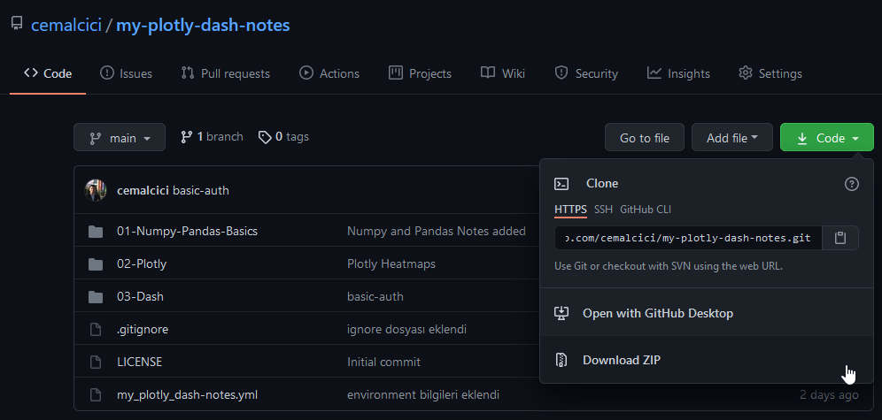
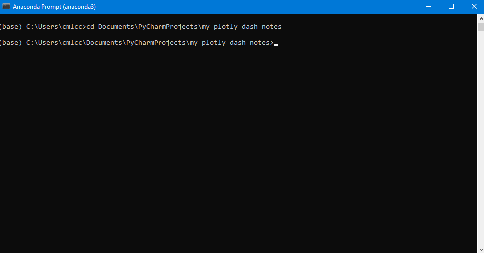

# Plotly & Dash Notes

[Interactive Python Dashboards with Plotly and Dash](https://www.udemy.com/share/101WaOAkcTdVZWRXQ=/) eğitiminden aldığım notları bu repoda derledim. Dash kütüphanesinin amacı, interaktif görselleştirme araçları oluşturan web uygulamaları oluşturmak. Plotly görseller konusunda yardımcı oluyor.

## Kurulum

Çalışmaları kendi bilgisayarınıza indirerek test edebilirsiniz. Giriş kısımlarda notlar bulunmakla beraber ilerleyen bölümlerde kod yapılarını anladığım için not alma gereği duymadım.

### Gereklilikler

* Anaconda Python 3.7+

### Adım 1



Download ZIP bölümünden repoyu indiriyoruz.

### Adım 2



Anaconda Prompt terminalini açıp kodların bulunduğu klasöre gidiyoruz.

### Adım 3

Sonrasında aşağıdaki komutları sırası ile yazıyoruz.

```
conda env create --file my_plotly_dash-notes.yml
conda activate my-plotly-dash-notes
```

### Adım 4

Her şey tamam. Uygulamaları çalıştırabiliriz. Keyifli keşifler!
